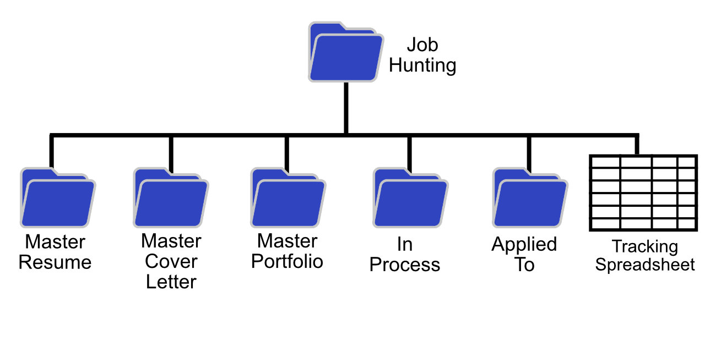

import BackButton from '@components/BackButton/BackButton'

Your job hunting is best achieved by being organized and keeping your materials on hand when you need it. 

## Why You Should Get Organized
- **Save time when applying at different companies that have similar jobs**. Often the resume and cover letter can be very similar. Copying and pasting from the similar company would be faster than creating a new set of documents from scratch.

- **Heading into an interview and discovering the job description you applied to isn't available on the web anymore**. It gets hard to prepare for the job interview if you can't remember what the job is about. Interviewers would be very disappointed if you didn't even know what job you were interviewing for. It makes sense that the job description gets pulled down from the web once they have 5 or 10 qualified candidates applying for the job. 

## Master Resumes, Master Cover Letters and Porfolios
### "Master" Resumes
 
Keep track of the resume that contains everything you can think of ever putting into a resume. From this "Master" resume, you will copy and paste items into the resume targeted to the specific job you are applying for. Those items will be edited to fit the job description for each job.

### "Master" Cover Letters

As you write cover letters for various jobs, saving particularly good sentences or paragraphs for reuse in later cover letters is a good way to save time and effort. 

### Portfolios

You may end up making multiple portfolios, for different types of opportunities. And portfolios need constant updating, adding the latest projects as well as removing projects that simply don't make the cut anymore. Your portfolio also needs to be edited properly for whatever job you are applying to.

## Things to Remember

It is helpful to keep these facts while you are searching for jobs.

- The jobs you have applied for - job description, application date, number of times applied to a company, address where you submitted your resume.
- Each Cover Letter and Resume that you send with each job application

## A Reasonable Start

On a personal computer, it makes sense to have a folder called "Job Hunting" to collect all your job hunting information, with sub folders called Master Resume, Master Cover letter and Master Portolio. Also create a folder called "In Process" and "Applied To" under "Job Hunting" (for jobs you are in the process of applying to and those that you've already applied to). And a spreadsheet to monitor which jobs you applied to and when you applied to them.

### Examples go here

<BackButton client:idle />