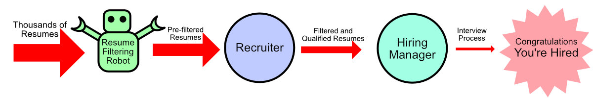

## How do you get a job? 

The better question to ask is **How do employers find people to work for them?** It's important to see the process from the other side when you're looking for a job. How *does* the company hire new workers?

### One Job, Many Applicants

Coveted jobs have many qualified applicants applying for these jobs. Sometimes, tens of thousands of people will apply to a company for a small number of jobs. That's **tens of thousands of applicants every week**. 

If you had to read 10,000 applications for a job every week, how would **you** figure out the best person to hire?

The best process in the twentieth century, was to go through these applications and sort out the people who don't qualify first, then start sorting them again to figure out the best applicants and weed out the rest. Note that all these resumes and cover letters were written on paper and delivered in envelopes, meaning that what kind of paper and how easy it was to read your handwriting mattered, because if it wasn't easy to read, they'd just filter it out for the REJECT pile.

As you might imagine, it's very hard for the Recruiter to go through all those resumes and filter them down to just a handful. They've come up with tricks to find the best applicants as quickly as possible and [we've got tips for you to **not** get filtered out](/common-ideas/recruiters-are-busy/).

### The Latest Tricks for Recruiters

With the advent of job websites, PDFs (Portable Document Format), email and computer automation, recruiters have the ability to further reduce the applicants they must review.

The Resume Filtering Robot isn't a single universal design (each one can be written differently and will have different levels of sophistication). And even if the robot doesn't exist or they forgot to turn it on, we're going to pretend that it's there because the bot was written to follow the techniques of the recruiter. 
If you make it simple enough for a robot to figure out how qualified you are, then you're going to make it easier on a human being to see how qualified you are.
