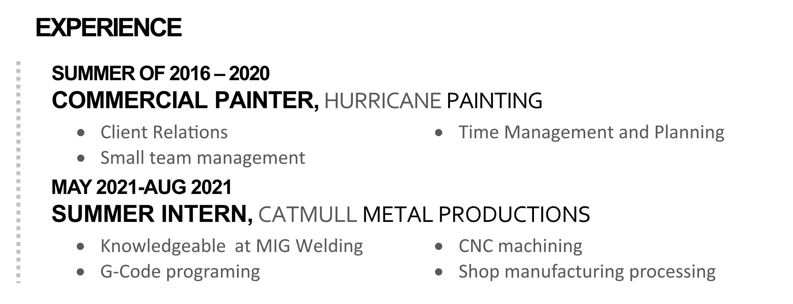
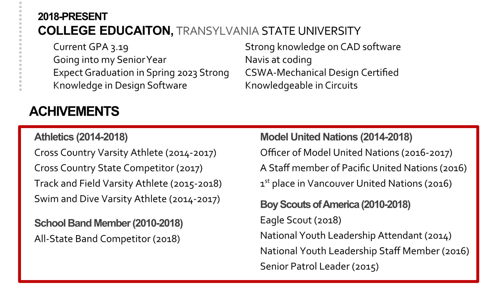

## The Target Job Description

Here is a description of a job that might be a goal for the resume shown.

> Anonymous Builders is seeking Project Engineer Interns, to work on commercial projects within our core markets: healthcare, higher education, advanced technology, life sciences, and commercial. Exact role will vary job to job. The intern will work closely with members of the project team and will be responsible for participating in the following tasks:
> *	Project Document Controls – RFI’s, architectural supplemental instructions, submittals, drawing logs and updates, project directory maintenance, transmittals
> *	Safety – safety audits
> *	Meetings – minutes, attendance for learning purposes
> *	Schedule – procurement data, delivery dates of materials
> *	Cost Control – change order review, quantity takeoffs
> *	Estimating – quantity takeoffs, bid reviews
> *	Closeout – binder assembly, collecting closeout documents
> *	Quality Control – rolling completion list, punchlist
> *	Communication – with architects, subcontractors, owners, teammates

### This Job's Requirements

The job requires somebody who is:
* responsible for project documents
* safety audits
* manages schedules
* understand costs and estimates 
* communicates well

In addition, it would help to show engineering, manufacturing and building expertise and experience.

An applicant needs to show responsibility, leadership, discipline, communication and general teamwork skills to rise above the rest of the applicant field.

How can we communicate the above points in the current resume?

### Emphasize Education

This applicant's job experience is impressive as a builder/carpenter/painter, but to be a project engineer requires skills beyond that, especially in the use of computer software, especially in Computer aided design (CAD) and engineering software. So we will move the education to the top of the page.

### Dig Deeper into Job Experience

Look again at the experience listed in the resume.

* The commercial painting job seems to indicate working with teams, customers and project planning. We need to emphasize these skills.
* The second job shows specific skills at CNC Machining (Computer Numerical Controlled machining) and welding, skills that are useful in a construction job site and good things to understand when estimating projects timelines or expenses. 

### Dig Deeper into Achievements

* A commitment to athletics in individual sports like running and swimming is a great example of personal discipline. 
* A commitment to a musical group is essentially joining a team and a good example of teamwork.
* Model United Nations is a good example of communication and leadership.
* Being an Eagle Scout, Senior Patrol Leader and National Youth Leadership Staff Member in the Boy Scouts of America is a great example of the understanding of teams, leadership, discipline and perseverance. 
Only one percent of Boy Scouts achieve the rank of Eagle Scout, with many organizations giving extra clout to applicants with Eagle Scout.
