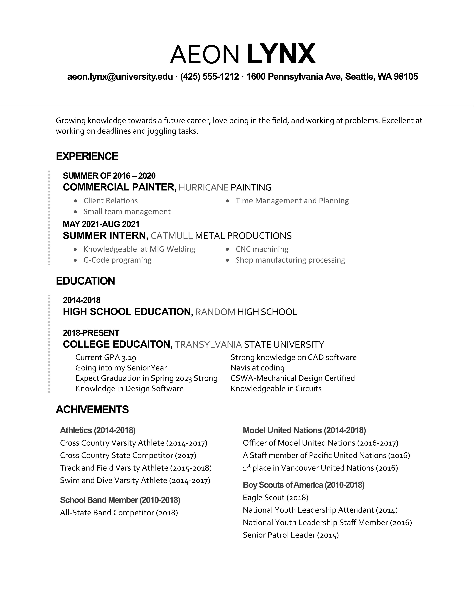
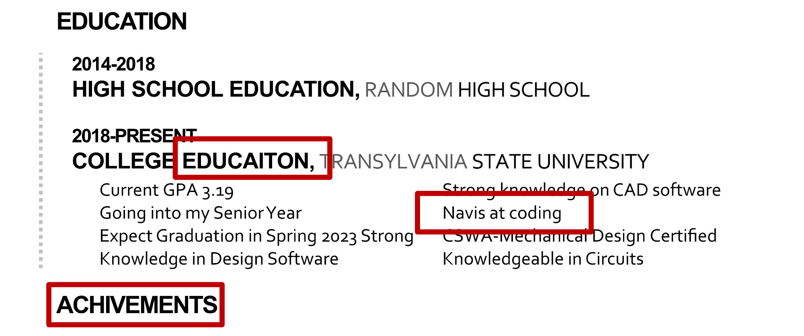
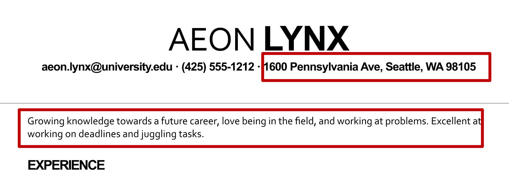

*This case study is a somewhat fictionalized case of an actual resume and job description.*

## Check Your Spelling and Grammar

Your spelling and grammar should be perfect. Some recruiters immediately discard resumes as soon as they find basic spelling errors. In the image above, *education*, *achievement* and *novice* are misspelled. Any spell checker would have marked these as unfamiliar spellings. At the absolute minimum, you must use the spell checker and correct all spelling errors.

## Optional Items

[Your address isn't recommended](/resume/tips/address-not-recommended) to be part of your contact information since most companies would prefer to contact you via telephone or email anyway. Companies might prefer local candidates over out of town candidates, so the only time you should use any locality is if you are within commuting distance from the job site. If you are within commuting distance, you should use "Seattle Metropolitan Area" instead of your address.

[A goal statement at the top of the resume is optional](/resume/tips/goal-is-optional). If your resume experiences and education don't seem to fit the job description, the goal statement isn't going to change the mind of the recruiter. Goal statements are often just a waste of space - space that could be better used making the rest of your resume tell your story about how you are the best person for this job.
