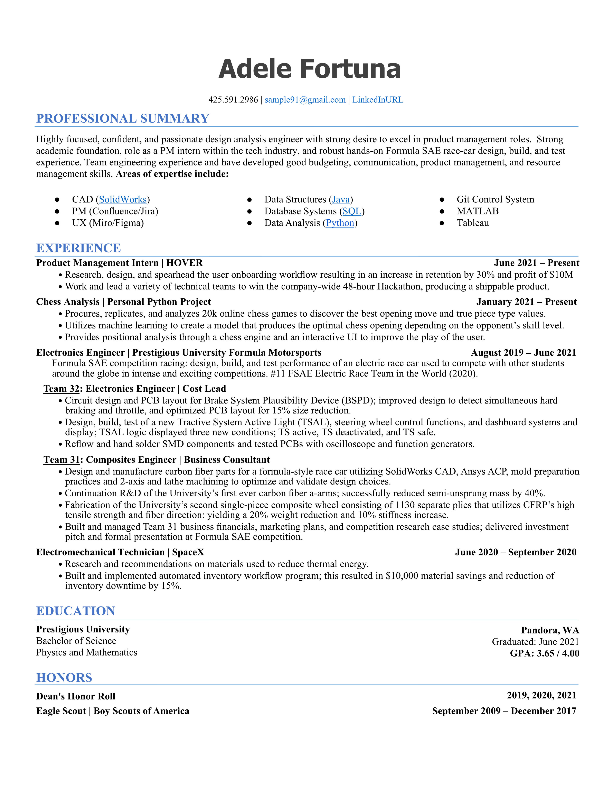

*This case study is a somewhat fictionalized case of an actual resume and job description.*

The applicant in this case was looking for a position in project management of software projects. Looking at this resume, you can see a lot of outstanding direct experience with materials and engineering of hardware. This resume would be great to apply to building prototypes or engineering models or manufacturing or even rocket manufacturing. 

Zoom in using pinch (on touch devices) or by holding ctrl/cmd and pressing the + key. Ctrl/cmd with the - key unzooms.

## Contact Information

This is fantastic in that only the phone, email and LinkedIn is listed. The only flaw here is that **LinkedInURL** is meant to be clicked on, but the recruiter can't see the LinkedIn URL at all if the resume is printed. Make it easy to see even if the resume is printed on paper by replacing **LinkedInURL** with **LinkedIn: /in/adelefortuna88** or whatever your URL.

## Professional Summary

While [the summary is optional](/resume/tips/goal-is-optional), in this case it may be necessary since the resume looks ideal for a **hardware engineer**, but the applicant wants a software position. 

The list of areas of expertise is nicely compact, it includes items that don't really apply to a project manager (CAD, Data Structures, Database Systems, Git and MATLAB). 

This section takes up too much valuable space on the page, so we need to figure out how to slim it down to only what's necessary.

## Education and Honors

The Education is something we want to show much earlier on the resume, especially with the very good grade point average. And there is a *lot* of whitespace that is going to waste here.

The Honors section is succinct and to the point without any extraneous entries. The only thing to fix is to replace the dates in that section with number of quaters on the Dean's Honor Roll and years in the Boy Scouts.