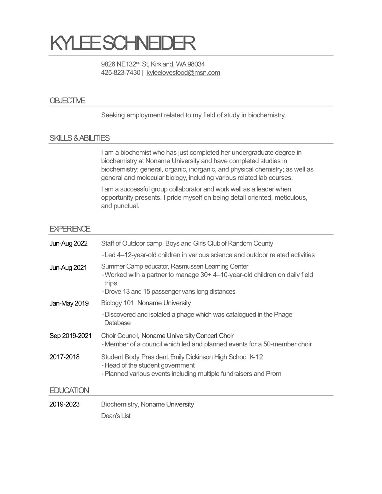
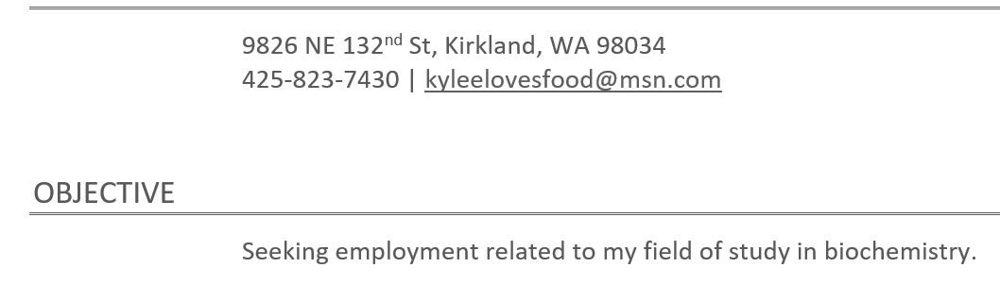
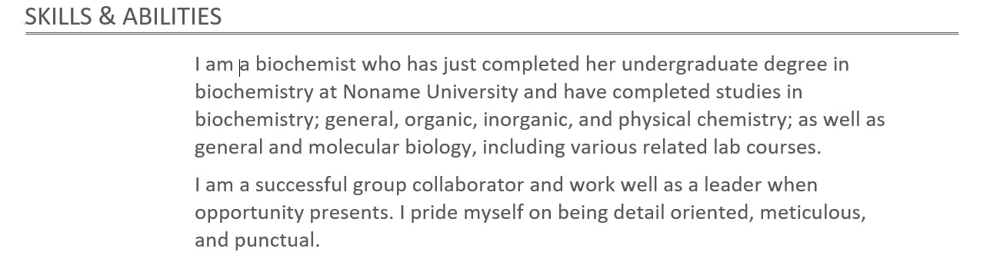
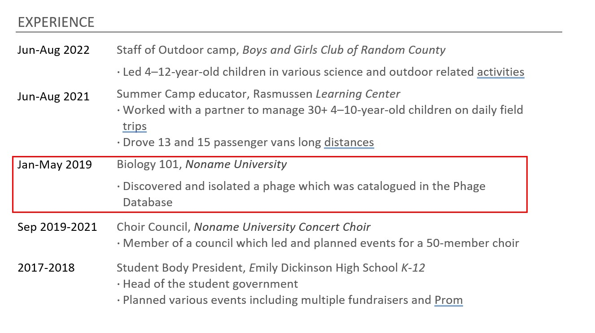
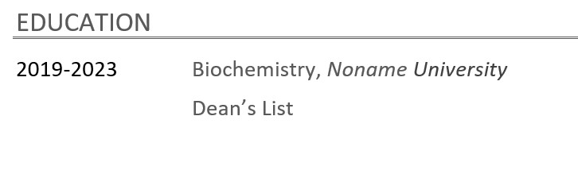

 
*This case study is a fictionalized case of an actual resume and job description.*

## Critique

First we start with the positives

* This resume is well organized and takes only a quick glance to find what we want. 
* The text is easy to read and the resume is very nice to look at.

We will make suggestions and changes by section.

## Contact Information

* [Addresses are not recommended](/resume/tips/address-not-recommended) unless you are applying to a company close enough to commute to every day for work.
* In this fictionalized example, the email address provided isn't professional (kyleelovesfood@msn.com). With free email accounts everywhere, create a professional sounding email address.
* The [addition of a LinkedIn account](/resume/tips/use-linkedin) is always a good way to improve this section. You could even use LinkedIn as your email address if you check your email often.
* Consider changing the vertical bar that separates the phone number and email with a filled circle, just so the [vertical bar couldn't be confused with the number 1](/resume/tips/keep-it-readable).
* The fact that the phone number and email has no label *might* be a problem if a [PDF scanning program](/resume/tips/no-icons-or-graphics) was looking for the phone number and email. On the other hand, the formatting of those letters and numbers are pretty unique and easy to figure out.

## Skip the Objective

* [Omitting the Objective or Goal statement is recommended](/resume/tips/goal-is-optional) as long as your resume is clearly targeted toward the job posting. The given objective is extremely vague - *employment related to my field* - so it hardly seems worthy of any space. If you have an objective statement, make sure it clearly describes the specific job you are applying for.

## Skills and Abilities

There's important information in this section to inform a recruiter about how this applicant can be a good candidate for the job, specifically the education information. But it's not at all quickly accessible to skimming eyes. And it's not in the Education section, where a recruiter is bound to look.

The paragraph on group collaboration is nice, but it's better to show through life and job experience about your teamwork, leadership and collaboration skills.

All that said, let's take the good stuff and merge it into places where recruiter expect to find them.

## Split up the Experience Section

In the photo above, the red framed item is the only item that directly pertains to biochemistry. All the other items have value in life experience, so let's create two sections, Biochemistry experience and other experience.

## And Finally, Education

As a recent college graduate who has a Biochemistry degree and wants a career in biochemistry, this is the most important section in the entire resume. This deserves to be the first section AND it should contain details about relevant techniques, tools and academic papers written for this degree.

> ### Education and Skills
> * **Bachelor of Science** from Noname University in Biochemistry - Dean's List (4 quarters)
> * Skill with laboratory techniques such as pipetting, standard creation, purification, centrifugation, titration, calibration of various lab equipment, organic synthesis, and lab notebook keeping
> * Experience with H-NMR, IR, mass spectrometry, UV-VIS spectrometry, chromatography, fluorescence spectrometry, oxygen bomb calorimetry, etc